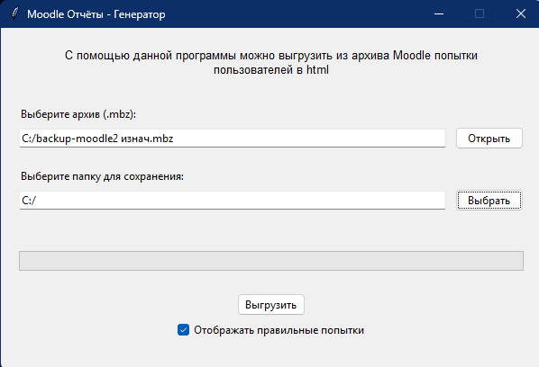
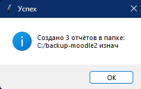
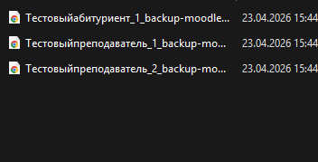
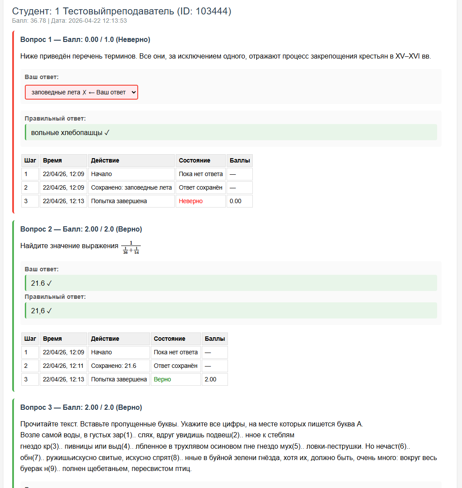
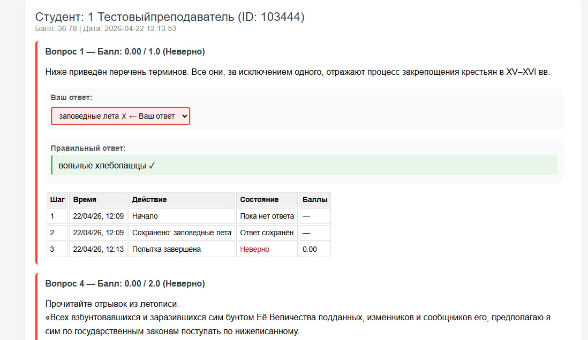

# Инструкция по использованию MoodleReports

## Скачивание

[Скачать MoodleReports.exe](https://github.com/Altersam/Moodle_html_reports/releases/latest/download/MoodleReports.exe)

## Что умеет программа

- Извлекать данные о попытках из backup-архивов Moodle (.mbz)
- Создавать отдельный HTML-отчёт для каждого студента
- Показывать правильность каждого ответа
- Встраивать изображения в отчёты
- Фильтровать правильные/неправильные ответы

---

## Шаг 1 - Запуск и интерфейс

Запустите **MoodleReports.exe**. Откроется главное окно:

**Основные элементы интерфейса:**
- Кнопка **"Открыть"** - выбор файла .mbz
- Кнопка **"Выбрать"** - выбор папки для сохранения
- Кнопка **"Выгрузить"** - запуск экспорта
- Чекбокс **"Отображать правильные попытки"** - фильтр для показа/скрытия правильных ответов

> **Важно:** Поставьте галочку в чекбоксе, чтобы в отчёте отображались все вопросы. Снимите галочку, чтобы показать только неправильные ответы.

---

## Шаг 2 - Выгрузка отчётов

Нажмите **"Выгрузить"**. Программа распакует архив, обработает данные и создаст отчёты.

После завершения появится сообщение:

В сообщении указывается путь к папке с отчётами и количество созданных файлов.

---

## Шаг 3 - Результаты в папке

Откройте папку, которую выбрали для сохранения. Там будут файлы:

Каждый файл именуется по ФИО студента: `Иванов_Иван_moodle_backup.html`

Откройте любой файл в браузере - там будет подробная информация о попытках.

---

## Шаг 4 - Пример отчёта (все вопросы)

Так выглядит отчёт, когда чекбокс **"Отображать правильные попытки"** включен (галочка стоит):

В отчёте отображаются все вопросы и правильные/неправильные ответы.

---

## Шаг 5 - Пример отчёта (только ошибки)

Так выглядит отчёт, когда чекбокс **"Отображать правильные попытки"** снят (галочки нет):

Показаны только вопросы с неправильными ответами - удобно для самопроверки.

---

## Поддерживаемые типы вопросов

| Тип | Описание |
|-----|----------|
| multichoice | Выбор одного ответа из нескольких |
| multianswer | Cloze - вопро��ы с несколькими ответами |
| shortanswer | Текстовый ответ |
| match | Сопоставление |
| gapselect | Заполнение пропусков |

---

## Частые проблемы и решения

| Проблема | Решение |
|----------|---------|
| Архив не открывается | Убедитесь, что это файл .mbz Moodle |
| Отчёты не создаются | Проверьте наличие quiz.xml и questions.xml в архиве |
| Пустые отчёты | Проверьте, что есть попытки пользователей |
| Ошибка изображений | Изображения должны быть в папке files внутри архива |

> **Важно:** Программа работает только с архивами Moodle (.mbz). Обычные ZIP-архивы не подойдут.